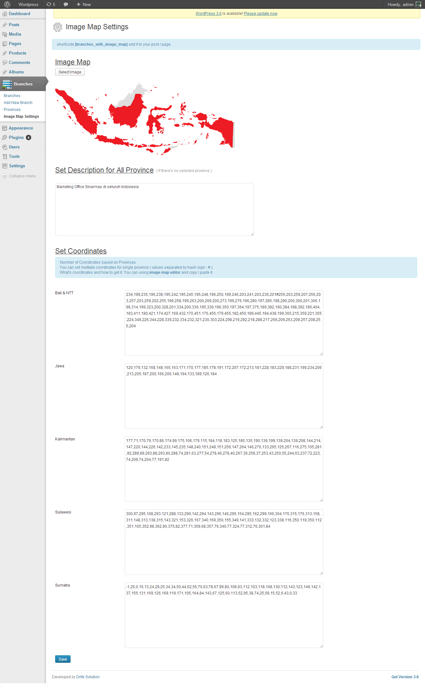

# Wordpress Plugin - Branches Post Type with ImageMapper

Branches Post Type with ImageMapper is Custom Post Type whom you can insert Branches 
and group it by Province / State with HTML Image Map. 
Image Map highlighted by province / state and include Ajax Functionality to load data based province / state.
Branches Post Type with ImageMapper include shortcode so you can insert it into post / page.
View support responsive.

I think it useful so I share it to you.
Now Branches Post Type with ImageMapper just support one HTML Image Map.

##### [Demo](http://sinarmas.e-ukm.com/kenali-smile/marketing-office/)
##### License: [http://creativecommons.org/licenses/by-nc-sa/3.0/](http://creativecommons.org/licenses/by-nc-sa/3.0/)
##### Using [Jquery Plugin Image Map from Jamietre](https://github.com/jamietre/ImageMapster)

## Screenshot

